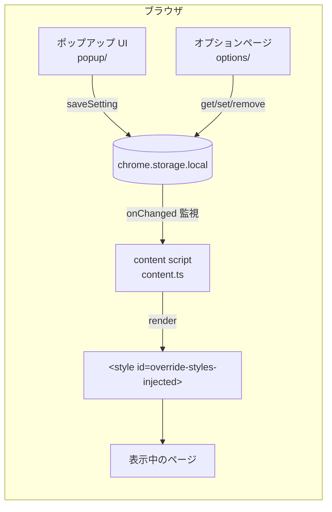
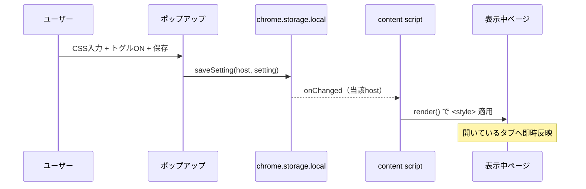
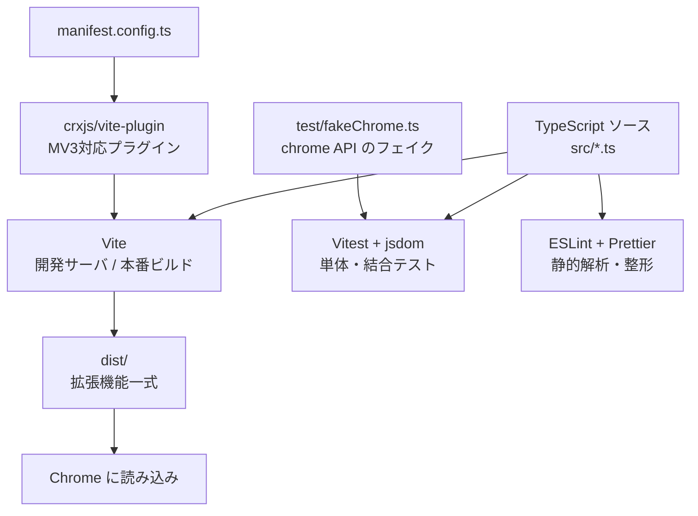

# アーキテクチャ

Override Styles の構成・データフローと、開発環境（ビルド/テストツール）の役割をまとめます。

## 全体像

ホストごとに保存した CSS を、表示中のページへ `<style>` として注入する Chrome 拡張機能（Manifest V3）です。設定は `chrome.storage.local` に保存し、変更を監視して開いているタブへ即時反映します。

## コンポーネント

| 場所                 | 役割                                                                                   | 動作環境         |
| -------------------- | -------------------------------------------------------------------------------------- | ---------------- |
| `src/content.ts`     | 各ページに注入されるブートストラップ。設定を取得し `render` で適用、storage 変更を監視 | 注入先ページ     |
| `src/lib/inject.ts`  | CSS 注入ロジック。`<style id="override-styles-injected">` の適用・解除                 | content から利用 |
| `src/lib/storage.ts` | `chrome.storage.local` アクセス層（取得・保存・監視・import/export）                   | 全体で共有       |
| `src/lib/types.ts`   | 型定義（`DomainSetting` / `Store` / `ExportData`）                                     | 全体で共有       |
| `src/popup/`         | ツールバーのポップアップ UI（現在ホストの設定編集）                                    | 拡張自身のページ |
| `src/options/`       | オプションページ（全ホストの一覧・import/export）                                      | 拡張自身のページ |

> popup / options は拡張自身のページ（`chrome-extension://`）で動作し、ページ側 CSP の影響を受けません。content script のみ注入先ページの制約を受けます。

## データフロー（設定の保存と反映）

## 開発環境の役割と構成

このプロジェクトは TypeScript で書き、ビルドとテストにツールチェーンを利用します。各ツールの役割は次のとおりです。

| ツール                 | 役割                                                                                          |
| ---------------------- | --------------------------------------------------------------------------------------------- |
| **Vite**               | TypeScript を変換・結合し、開発サーバ（HMR）と本番ビルド（`dist/`）を提供する汎用ビルドツール |
| **@crxjs/vite-plugin** | Vite を Chrome 拡張（Manifest V3）のビルドに対応させるプラグイン                              |
| **Vitest + jsdom**     | 単体・結合テストの実行環境。ブラウザなしで DOM を再現                                         |
| **test/fakeChrome.ts** | `chrome.storage` などをインメモリで再現するテスト用フェイク                                   |
| **ESLint + Prettier**  | 静的解析（lint）とコード整形                                                                  |

詳しいビルド・テスト手順は [開発ガイド](./development.md) と [テスト方針](./testing.md) を参照してください。

## 設計判断

主要な設計判断は [ADR](./adr/) に記録します。例: content script のバンドル方式（[ADR-0001](./adr/0001-content-script-bundling.md)）。
